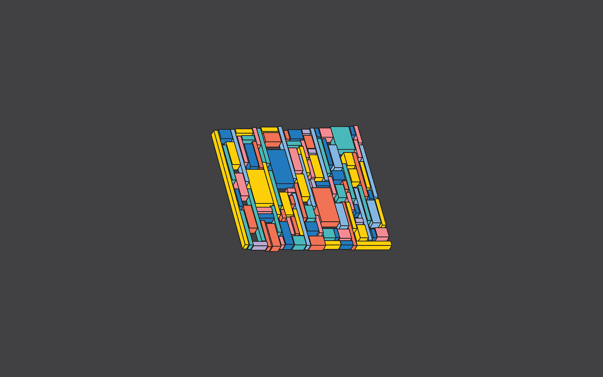

# STUBBEDEV DOTFILES

<!--toc:start-->
- [STUBBEDEV DOTFILES](#stubbedev-dotfiles)
  - [STRUCTURE](#structure)
  - [INSTALLATION](#installation)
<!--toc:end-->

This is a collection of personal dotfiles and utilities I use on linux. They are bundled as an installer and a maintenance utility.

## STRUCTURE

The dotfiles and utilities are stored and applied in a way where they try to be as self contained as possible.
The main way I try to achieve this is by creating a directory `~/.stubbe` and symlinking this git repository to that path.
This means that all settings should be removed together with the utils from your system, if you delete the repo.

The structure is as follows:

```tree
.stubbe/
├── bin/
│   ├── scripts/
│   ├── utils/
│   ├── fzf-tmux-project-picker*
│   ├── fzf-tmux-session-picker*
│   ├── install-funcs*
│   ├── stb*
│   ├── stb-install*
│   ├── tmux-lazy-docker*
│   ├── tmux-lazy-git*
│   ├── tmux-new-session*
│   ├── tmux-new-temp-session*
│   └── tmux-system-monitor*
├── src/
│   ├── alacritty/
│   ├── btop/
│   ├── dunst/
│   ├── fonts/
│   ├── go/
│   ├── hypr/
│   ├── icons/
│   ├── ideavim/
│   ├── keyd/
│   ├── lazygit/
│   ├── nvim/
│   ├── picom/
│   ├── regolith/
│   ├── regolith-look/
│   ├── screenlayout/
│   ├── starship/
│   ├── sway/
│   ├── tmux/
│   ├── wallpapers/
│   ├── waybar/
│   ├── wezterm/
│   ├── xmodmap/
│   └── zsh/
└── README.md
```

The bin directory contains `stb` and `stb-install` which are the 2 utility binaries. It may also contain other utilities binaries if directly included in the repo.

In the `src` directory we find various applications, each with their own directory. If an application such as `zsh` or `golang` install more packages, they are placed in a child directory of that plugin.

## INSTALLATION

In order to install the utils and config, you simply need to run the following command:

`git clone --depth 1 git@github.com:stubbedev/dotfiles.git && cd dotfiles && ./bin/stb-install`

The installer will prompt you with options on what to install.

After installation you can use the `stb` followed by an option to add stuff to your config.

If you provide no option the wizard will list the available options.


