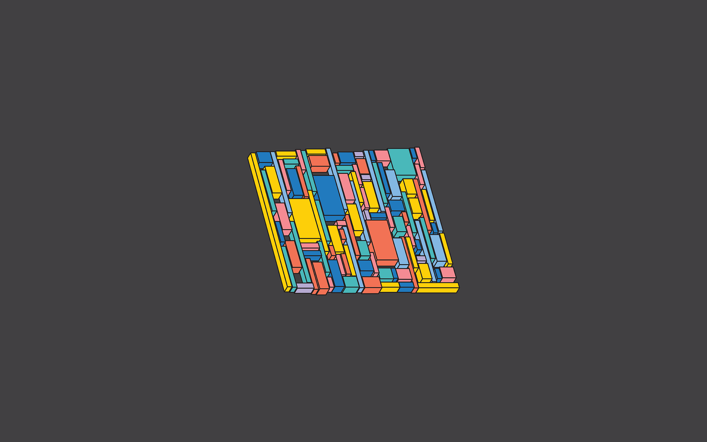

# STUBBEDEV DOTFILES

Personal Linux dotfiles and utilities, bundled as a Nix flake with an
installer and a maintenance front-end. Works on both NixOS and non-NixOS
hosts via home-manager.

## STRUCTURE

The config is kept self-contained: the repo is symlinked to `~/.stubbe`, so
removing the repo removes the settings with it.

One file per **aspect**, and each aspect owns everything about itself — its
packages, its config files, its systemd units, its activation steps, and both
its NixOS and its home-manager half. There is no `packages/` bag, no `files/`
bag and no `activation/` bag to keep in sync: to change how mail works you edit
`modules/mail.nix`, and that is the whole story.

```tree
.stubbe/
├── flake.nix              # inputs; outputs are `import-tree ./modules`
├── modules/
│   ├── core/              # the foundation (see CONVENTIONS below)
│   ├── hosts/             # host definitions, one file each
│   ├── dev/               # flake checks, lint, `nix fmt`
│   ├── ai/, browsers/     # aspects big enough to want a directory
│   └── <aspect>.nix       # mail, shell, hyprland, wayle, power, storage, …
├── bin/                   # shell scripts built into Nix-managed binaries
├── src/                   # app config files, one directory per aspect
└── secrets/               # sops-encrypted, keyed per machine in .sops.yaml
```

`bin/` scripts are built into the Nix profile's `bin/` by home-manager.
`stb-install` is the only one that runs from the checkout — it bootstraps Nix
and home-manager on a fresh host.

## CONVENTIONS

1. **One file, one aspect, both classes.** Every file under `modules/`
   registers under `flake.modules.homeManager.<aspect>` and/or
   `flake.modules.nixos.<aspect>`. Values shared between the two halves are
   let-bound at the top of the file, which is what stops a NixOS module and its
   non-NixOS activation from drifting apart. Hosts import a whole class with
   `builtins.attrValues`; nothing references a module by name.

2. **No opt-outs.** Every `.nix` file under `modules/` is auto-loaded by
   import-tree and must be a flake-parts module. There are no
   underscore-prefixed exceptions and no `lib/` directory: shared code lives in
   `pkgs.stubbe` or in an option.

3. **Two ways to reach shared code, and no third.**
   - `pkgs.stubbe.*` — an overlay (`modules/core/pkgs-stubbe.nix`) carrying the
     pure data (`colors`, `theme`, `newtabUrl`, `cache`) and every builder that
     needs `pkgs` (`file`, `render`, `secret`, `scriptBin`, `install*`, `json*`).
     Reachable from any module of any class, because it rides on `pkgs`.
   - `config.stubbe.*` — options for anything derived from the configuration:
     `paths`, `gfx`, `setup`, `mutable`, `mcp`.

   There is no `specialArgs` and no `extraSpecialArgs` anywhere. A module that
   needs a flake input resolves it at flake-parts level, where `inputs` is
   already in scope. This is what makes every aspect movable between the two
   targets without rewiring.

4. **Feature gates and the platform split.** Behaviour toggles are
   `features.*` options (`modules/core/features.nix`), gated with
   `lib.mkIf config.features.<x>`. NixOS aspects gate on
   `config.stubbe.userFeatures.<x>`, the same flags resolved once from the
   primary user. On NixOS the declarative half owns system state; on any other
   distro the same aspect's `stubbe.setup.<name>.privileged` activation writes
   the equivalent files into `/etc`, and gates itself off on NixOS.

5. **Activation steps.** `stubbe.setup.<name>` (`modules/core/setup.nix`) is
   the one way to run imperative work at switch time. The attribute name is the
   DAG node name; `privileged = true` adds the shared sudo-prompt scaffolding,
   a content-hash lock so an unchanged step costs nothing, and the NixOS gate.

6. **Mutable files.** `xdg.configFile` / `home.file` — read-only store symlinks
   — are the default. `stubbe.mutable.<path>` (`modules/core/mutable.nix`) is
   for the three cases that cannot be: `link` (point at the live checkout so an
   edit needs no rebuild), `copy` (the app rewrites the file, so re-assert ours
   each switch) and `seed` (write only if absent).

7. **Generate config from Nix where Nix owns a value.** Anything carrying a
   colour, a path or a store reference is generated — so the Catppuccin palette
   exists once, in `modules/core/lib.nix`, and flows into alacritty's TOML,
   btop's theme, lazygit's YAML, rofi's rasi, the hyprtoolkit conf, the fzf
   options and the new-tab page. Files under `src/` are the ones with no
   Nix-derived content and no schema to validate against; they stay verbatim.

## INSTALLATION

```sh
git clone --depth 1 https://github.com/stubbedev/dotfiles.git
cd dotfiles && ./bin/stb-install
```

The installer prompts for what to install. Day-to-day rebuilds then run
through `hm`.

## APPLYING THE CONFIG

The flake lives at the repo root. Apply with:

```sh
hm switch --flake "path:$HOME/.stubbe"
```

Or directly with home-manager:

```sh
home-manager switch --flake .#stubbe --impure
```

`--impure` is required because activation scripts read `$HOME` and detect the
host distribution at evaluation time.

## NIXOS INSTALLER ISO

Build a bootable installer ISO that mirrors the `stubbe-nixos` host:

```sh
nix build .#installer-iso --impure
# Output: ./result/iso/*.iso — flash to a USB stick.
```

Boot the live USB on the target, log in as `root`, and run:

```sh
stb-install-nixos
```

It partitions the disks as a btrfs volume, runs `nixos-install`, and clones the
repo to `/mnt/etc/nixos`.

Optional hardening is available behind per-host flags in the host file
(`modules/hosts/stubbe-nixos.nix`):

- **Secure Boot** (`host.secureBoot`) — lanzaboote signed bootloader; enroll
  keys with `sbctl` first.
- **Impermanence** (`host.impermanent`) — wipes `/` on every boot, keeping only
  paths declared in `modules/impermanence.nix`.

Both require setup steps before flipping the flag — see the comments in the
host file and module.


